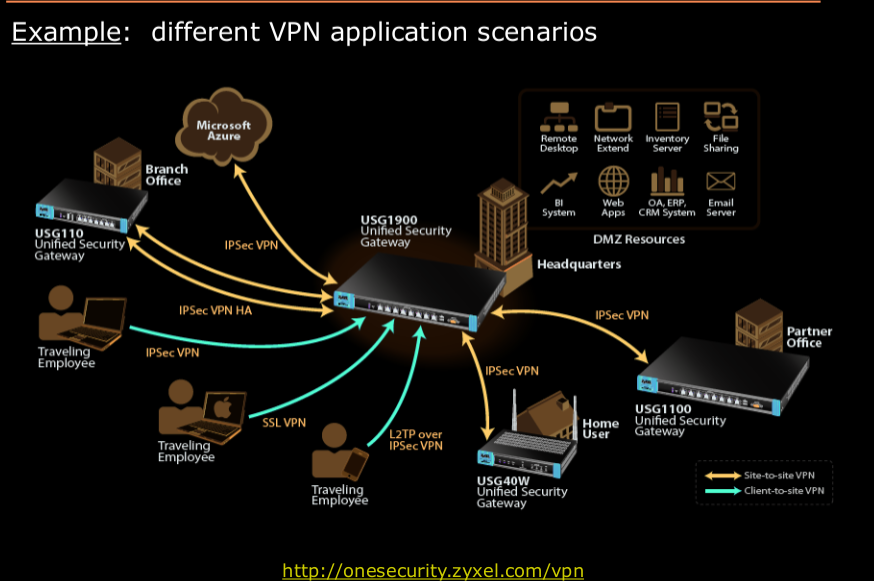
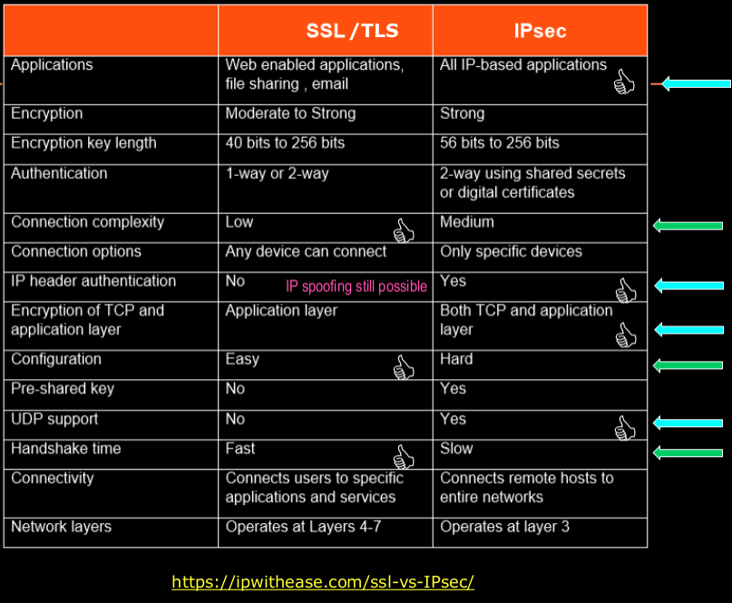

# VPNs?

## Internet/IP Deficiences
1. Initially, the internet (aka arpanet) was small and relatively private.
2. In private neworks, you dont need to build security into the protocol- you need to build it into the building.
3. Today, a mass of untrusted devices are connected to the internet.
4. Futhermore, routers are owned and administered by 'who knows who'.
5. Thus 'who knows who' stand between you and your others devices.
6. Back then only end-host attacks were possible, now attacks can happen from anywhere.

## Security CIA and IP
1. IP indirectly violates Integrity and Authenticity in the CIAAAA triad. 
2. IP protocol provides no assurance of: 
* data authenticity- IP addr can be spoofed. 
* data confidentiality- cleartext by default can be read by intermediate routers and links.
* data intregrity- theoretically, a adversary router could change both IP packet payload and checksum.
3. Different method that have evolved over the years to addres lack of security in IP protocol:
* Application Layer: Pretty Good Privacy (PGP) is used to encrypt email messages; but cannot protect TCP/IP header and any other application.
* Transport Layer: TLS protects confendiality, data intregrity and user authenticity; BUT cannot protect IP(header) data nor application running on top of UDP.
* Network Layer: IPsec provides proectection for any higher level protocol or application without the need for additional security method. IPsec can protect:
* Confidentiality- by encrypting data
* Integrity- by hashing data checksum
* User Authenticity- through use of signatures and ceritifcates.
4. However, IPsec provides less control and flexibility for protecting specfic aplications than transport and application layers.

## VPN Into: Why do we need VPNs?
1. Private Network: network that is owned, managed and secured by one particular entity/organization. 
* When a network is composed of multiple segments, the segments are connected via a dedicated 'owned' or 'leased' (physical) lines.
2. Virtual Private: a secure network constructed by using public wries (the Internet) to connect it's different private-network segments.
* 'virtual tunnles' between private network segments can be created using various types of encryption protocols(IPsec, SSL)
3. In VPNs, security is ensured (more) by means of software than hardware.

## VPN Benefits (vs Owned or Leased Lines)
1. Reduced Equipment cost.
2. Faster ROI than traditional WAN infrastructure.
3. Rapid deployment.
4. Unlimited geographic connectivity.
5. Increased flexibility and versatility of worker location.
6. Reduced dependence on (one particular) ISPs
7. Reduced suppourt burden on ISPs.
8. Improved privacy and confidentiality dur to strong encryption.

## VPN Limitations (v.s. Leased Lines)
1. suboptimal QoS
 * VPN over the internet=> Latency, fragmentation, packet loss.
2. added overhead
 * VPN always incur encapsulation(traffic and processing) overhead.
3. problematic low-bandwitdth links
* encrypted traffic doe not compress as well (think of wireless).
4. VPN end-points= additional vulnerability.
* company's network administrators little to no control over remote devices.

## Different VPN Uses/Architectures
### Architecture1: Site-to-Site or Point-to-Point or Gateway-to-Gateway
1. Connecting two secure LANs
2. a single virtual tunnel between the routers/gateways can suppourt all communications between two networks.
3. Site-to-Site VPNs are often transparent to users who DO NOT NEED to perform sperate authentication to use VPN.
* No need for VPN client software to be installed. 

### Architecture2:End-to-Point or Host-to-Gateway
1. Typically used to connect remote employess (residing on non-secure networks) to corporate LAN over the internet.
2. The remote user's host/computer has to be configured to act as a VPN client.
* VPN client must be installed and configured.
3. User has to authenticate before using the VPN (a virtual tunnel between remote user and VPN gateway will be created over the internet).

### Architecture3: End-to-End or Host-to-Host
1. typically for special purpose needs, such as sys admin performing remote management on a signle server. 
2. VPN software has to be installed and configured on both the server and end-user machine. 
3. the user, the sys admin in this case has to authendicate before using VPN.
4. Additional security challenge: Firewalls and IDSs cannot inspect encrypted VPN data. 

## Extra VPN Classifications (IMPORTANT FOR CLOUD :))
1. Intranet VPN = IPsec and QoS for relaiable throughput = Site-to-Site = allow branch offices to be linked to corporate head-quarters in a secure manner
2. Extranet VPN = Extends WANs to Business partners = Site-to-Site = allow customers, suppliers, and partners to access corporate intranet in a secure manner
3. Access VPNs = End-to-Point or End-to-End = Secure, scalable and encrypted tunnels across a public network; client software.

## VPN configurations
1. Combined SW/HW VPNs- most common forms of VPNs.
2. deploy a dedicated VPN appliance at the central network and use client software at the remote end of each VPN connection.

## Different Protocol Implementations of VPNs
### Implementation1: VPN over IPsec
1. Best solution point-to-point.
2. Although IPSec can be used for end-to-point and end-to-end architecutre.
3. More costly and more complex set-up solution as IPsec requires installation of specialized IPsec software/hardware.
4. Operates at Layer 3. Once user is authenticated he/she gains full acess to private network. 
5. IPsec is not viable when non-IP traffic must be transported.

### Implementation2: VPN over SSL/TLS
1. Best solution for point-to-end. 
2. Althought it is used in end-to-end architure.
3. no hardware software hardware necessary- most browsers have SSL/TLS capability built into them.

