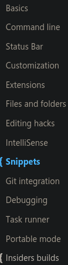

# My VS Code Editor Knowlege dump and Study Notes

Refresher Resource: https://code.visualstudio.com/docs/getstarted/tips-and-tricks#vscode

## Misc 
By starting VS Code in a folder, that folder becomes your "workspace". 
VS Code stores settings that are specific to that workspace in .vscode/settings.json, 
which are separate from user settings that are stored globally.

Alternately, you can run VS Code through the operating system UI, 
then use File > Open Folder to open the project folder.
