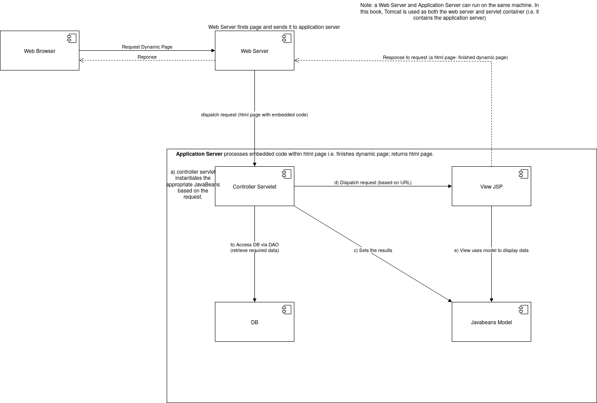

# What is a Web Application?

## Defintion
A web application is a computer program that utilizes web browsers, and web technology to perform tasks over the Internet.

For a business, effective management is only possible when it is able to ***capture*** and ***store*** all necessary data,
and have the means for ***processing*** this information and ***presenting*** the results to the user.

## How a web application works?
Web applications use a ***combination*** of server-side scripts (PHP and ASP), and client-side scripts (Javascript and HTML). \
***Server-side scripts to handle the storage and retrivel of information.*** 
***Client-side scripts to present infromation to users.*** 

Web applications are usually coded in browser-suppourted languages, like HTML and Javascript. 
These languages ***rely on the browser to render the program executable.*** 

Some applications are ***dynamic***, requiring server-side processing (generating dynamic content to provide the specialized functionality offered by a business, service, or application).
The way such dynamic web apps are displayed on a user’s screen is not predetermined but rather dynamically shaped by app logic that is implemented on the server side or the client side of the app.

While in a normal web application or the simple website. There is no request, response scenario. All and all it's just a client end with some HTML with some CSS or maybe Javascript or any other extension of Javascript. No server end.

While others are completely ***static***, requiring no server-side processing.

### In other words, (Another definition) 
A web application is a collection of static and dynamic web pages. A static web page is one that does not change when a site visitor requests it: The web server sends the page to the requesting web browser without modifying it. In contrast, a dynamic web page is modified by the server before it is sent to the requesting browser. The changing nature of the page is why it’s called dynamic.

For example, you could design a page to display fitness results, while leaving certain information (such as employee name and results) to be determined when the page is requested by a particular employee.

### Note:
Strictly speaking, a “static” page may not be static at all. For example, a rollover image or Flash content (a SWF file) can ***make a static page come alive***. However, this documentation refers to a page as static if it is sent to the browser without modifications. 

Recall also, ***a page request is generated*** when a visitor clicks a link on a web page, selects a bookmark in a browser, or enters a URL in a browser’s address text box. 

## Static web page

In the case of web applications, certain lines of code are undetermined when the visitor requests the page. These lines must be determined by some mechanism before the page can be sent to the browser. The mechanism is discussed in the following section.

## Process dynamic web page
When a web server receives a request for a static web page, the server sends the page directly to the requesting browser. When the web server receives a request for a dynamic page, however, it reacts differently: It passes the page to a special piece of software responsible for finishing the page. This special software is called an application server.

The application server reads the code on the page, finishes the page according to the instructions in the code, and then removes the code from the page. The result is a static page that the application server passes back to the web server, which then sends the page to the requesting browser. All the browser gets when the page arrives is pure HTML. Here’s a view of the process:

## Using a database? 
Using a database to store content allows you to separate your website’s design from the content you want to display to site users. 
Instead of writing individual HTML files for every page, you only need to write a page—or template—for the different kinds of information you want to present. 
You can then upload content into a database and then have the website retrieve that content in response to a user request. 

## Web server vs Application server
A web application requires a web server to manage requests from the client, a application sever to perfrom the requested task, and sometimes, a database to store information. 

A web server is software that serves web pages in response to requests from web browsers. 
A page request is generated when a visitor clicks a link on a web page, selects a bookmark in a browser, or enters a URL in a browser’s address text box. 

Application sever technologies range from ASP.NET, ASP and ColdFusion, to PHP and JSP.

Here's what a typical web application flow looks like: 
1. User triggers a request to the web server over the Internet, either through a web browser or the application’s user interface
2. Web server forwards this request to the appropriate web application server
3. Web application server performs the requested task – such as querying the database or processing the data – then generates the results of the requested data
4. Web application server sends results to the web server with the requested information or processed data
5. Web server responds back to the client with the requested information that then appears on the user’s display

## Examples of a web application
Web applications include ***online*** forms, shopping carts, word processors, spreadsheets, video and photo editing, file conversion, file scanning, and email programs such as Gmail, Yahoo and AOL. \
Popular applications include Google Apps and Microsoft 365.

## Benefits of a web application
- Web application runs on multiple platform regardless of OS or device as long as the browser is compatible.
- All users have access to the same version, eliminating compatibility issues.
- They are not installed on a hard drive, thus eliminating space issues.
- They reduce software piracy in a subscription-based web application (i.e. SaaS).
- They reduce cost for both the business aIncreased Internet usage among companies and individuals has influenced the way businesses are run. This has led to the widespread adoption of web applications as companies shift from traditional models to cloud-based and grid models. Web applications give businesses the ability to streamline their operations, increase efficiency, and reduce costs.nd end-user, as there is less support and maintenance required by the business and lower requirements for the end-user's computer.

## End Remarks
Increased Internet usage among companies and individuals has influenced the way businesses are run. This has led to the widespread adoption of web applications as companies shift from traditional models to cloud-based and grid models.\
Web applications give businesses the ability to streamline their operations, increase efficiency, and reduce costs. 

These online apps such as email clients, word processors, spreadsheets, and other programs provide the same functionality as the desktop versions. However, they have an added advantage of working across multiple platforms, having a broader reach, and being easily accessible from anywhere.

## Terminology
https://helpx.adobe.com/dreamweaver/user-guide.html/dreamweaver/using/web-applications.ug.html

## Source
https://blog.stackpath.com/web-application/
https://stackoverflow.com/questions/42735947/difference-between-a-dynamic-web-application-and-a-normal-web-application \
TODO:https://helpx.adobe.com/dreamweaver/user-guide.html/dreamweaver/using/web-applications.ug.html \
https://www.xperience-group.com/blog/subscription-vs-perpetual/

## Extra from Java for WebDev Book
https://github.com/SidB16/4413/tree/master/Java-for-Web-Development

Index
* In Chapter 2, you will replace this stand-alone Java application with a web layer using the web tier components of Java EE (specifically, servlets and JSPs). 
* You will use this data access layer throughout this book, and from Chapter 4 onward you will build a web application repeatedly by rebuilding the web layer using different web frameworks 

Theory
* ***Multitired architecture model*** --> General: Web Layer (presentation tier) then Application Layer (Logic tier) then Database layer (data tier) --> JEE  --> JEE Specific mutitier model:Client Tier then Web Tier then Service Tier then *EIS Tier.
* Sun developed JVM for each OS -> plain text files with .java extensions are compiled into bytecode instructions called .class files, using javac --> .class files are bytecode instructions that get read by JVM --> they get translated into machine-language operations that computer executes.

Detailed Descriptions
* The enterprise information system (EIS) tier, in J2EE architecture, handles enterprise information system software, which provides an enterprise’s critical business information infrastructure.
* A Java application is a computer program that executes when you use the java command to
launch the JVM. In the Java programming language, all source code is first written in plain-text
files (in Notepad, for instance, or in any text editor) with the .java extension. The source files are
compiled by the javac compiler into .class files that contain bytecode instructions. The JVM reads
these bytecode instructions and translates them into the machine-language operations that each
computer executes

In this chapter, you will take the first step by building a traditional stand-alone Java bookstore application. In Chapter 2, you will transform the stand-alone application into a web application. 

* A Java enterprise application can be defined as a Java application that
utilizes the enterprise services offered by Java EE. 
* In fact, a web application can be classified as
an enterprise application if it utilizes Java EE services in the form of components packed in the
web tier.

* Java EE isolates these services functionally into separate tiers, as ias illustrated in Figure 1-3,
by providing an application model on which the Java enterprise applications should be built. As a
consequence, the Java enterprise application mirrors the multitier architecture of Java EE. Figure 1-4
illustrates a generalized view of the layers of a typical web application.

* Each layer in Figure 1-4 is an area of concern, for the application. For instance, the web layer deals
only with employing the web tier components of Java EE. 
* Having different layers in an application results in what is called a separation of concerns. 
* In terms of implementation, this separation of concerns is achieved using coarse-grained interfaces i.e. different views.

#### If not Seperation of Concern?
* The concern is the feature, functionality or business functions with which the application’s developer needs to be concerned.
* Crosscutting such concerns is inherent in complex systems and leads to code scattering, which is when code for one concern spans many modules, and code tangling, which is when code in one module concentrates on addressing multiple concerns.
* Code scattering and code tangling lead to a lack of clarity, redundancy, rigidity, and continuous
refactoring.

Figure 1-5 illustrates how the system services of logging, transaction, and security
crosscut the business functions of the application.
* Exaplination: BookService in Figure 1-5 is too involved with the system services. Each object knows and is
responsible for logging, security, and transaction. A method, for example, to purchase a book in
BookService should be concerned only with how to purchase the book and not with whether it is secure or transactional.

#### WWeb Layer
The web layer of a web application consists of the web tier components of Java EE such as servlets
and JSP. The web layer can access the service layer, but there should not be a tight coupling
between the web layer and the service layer. That is, changing the service layer should not impact
the web layer.hy Seperation of Concern then?
Separation of concerns, one of the main goals of software engineering, lets you handle each service on its own and thereby does the following:
* Promotes traceability within and across the artifacts in the system, throughout
the life cycle of the system
* Controls the impact caused by the change, thereby providing scope for
evolution and noninvasive adaptation
* Promotes development of cohesive units, thereby facilitating reuse

#### Coming Back to this

###### Web Layer
The web layer of a web application consists of the web tier components of Java EE such as servlets
and JSP. The web layer can access the service layer, but there should not be a tight coupling
between the web layer and the service layer. That is, changing the service layer should not impact
the web layer.

###### Service Layer
The service layer consists of the business tier components of Java EE such as Enterprise JavaBeans
(EJBs). The service layer can access the data access layer, but there should be no tight coupling
between the service layer and the data access layer. In fact, the service layer should not know
anything about the web or data access layer. The service layer provides a coarse-grained interface
for the web layer.

###### Data Access Layer
The data access layer consists of the data tier components of Java EE such as JDBC and JPA. This
layer should not contain any business logic. This layer abstracts the actual persistence mechanism
(in other words, JDBC or JPA) from the service layer by providing the coarse-grained interface to the
service layer.

***Note***: The call flow in this architecture is always from the top layer to the bottom layer. In other words, the
service layer should be able to call the data access layer but not vice versa.

